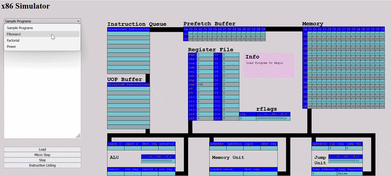

# VisualX86
A visualisation of the micro-operation level of an X86 processor.

My BSc Dissertation Project

Demo below:

The simulator works as follows:
- Takes a limited subset of x86 instructions as input, assembles them into a custom machine code.
- Machine code stored in simulator memory.
- 32 bytes of memory at a time is loaded into the prefetch buffer
- Code in the prefetch buffer is then decoded into x86 instructions
- These are then converted to a toy microcode
- These micro-ops are then processed in the execution units
- The results are written back to memory or the register file